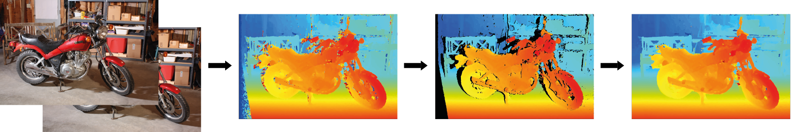

# FC-DCNN 



##### A densely connected neural network for stereo estimation
Dominik Hirner, Friedrich Fraundorfer

An implementation of a lightweight fully-convolutional densely connected neural network method for disparity estimation.
This method has been submitted to the **ICPR 2020** conference and is currently being peer-reviewed.
A demo of this network is available online. 
[colab](https://colab.research.google.com/drive/1i5k-YTCsmQC8IIURBh802oKeyZP_ZSHG)

The whole project is in pure python 3.6 with the exception of the jupyter-notebook inference script. For performace reasons the post-processing is done in cython which can be installed via: 

 ```pip install Cython ```

This repository contains

- jupyter notebooks for training and inference of disparity via a stereo-pair
- pure python3.6 code for training and inference
- trained weights for many publicly available datasets

The network was trained and tested on a GeForce RTX 2080 with 11GB of RAM.
The code is released under the BSD 2-Clause license. Please cite our paper (link) if you use code from this repository in your work.

## Trained weights

[Middlebury](https://drive.google.com/file/d/1DiuY47dnM4PUgzDg8SQZyZUyC09pVoDO/view?usp=sharing) |
[Kitti](https://drive.google.com/file/d/1Nce9yJeAs7u8Y1GpbJpgzP_RbLg9S3Rs/view?usp=sharing) |
[ETH3D](https://drive.google.com/file/d/19QxmKWHNgNnjOUFBPnVgGG3r3mkHY1nW/view?usp=sharing) |

## Usage
### Inference 
If you want to do inference on any rectified image-pair call the *test.py* function from the root of this repository as follows: 

 ```python test.py path/to/weight path/to/left_im.png /path/to/right_im.png max_disp /path/to/out/out_name```
#### Example on Middlebury
Download the Middlebury weights from the link above and put it in the *weights* folder in the root of this repository. Then copy and paste the following: 

```python test.py weights/mb example/im0.png example/im1.png 128 teddy```
*TODO: more graceful error-handling for parameter*

If everything went ok this should produce the following output: 

- teddy.pfm: filtered disparity output of the network
- teddybilat_and_med_mask.png: calculated foreground/background mask (see paper)
- teddy_s.pfm: disparity map with removed inconsistencies
- teddy_filled.pfm: disparity with updated inconsistencies (see paper)


**&#9733;&#9733;&#9733; New version of FC-DCNN with improved EPE and additional trained weights will be made available at [https://github.com/thedodo/fc-dcnn2](https://github.com/thedodo/fc-dcnn2) &#9733;&#9733;&#9733;**
